# 🏗️ Dettagli Implementativi e Architetture Custom

Questo documento fornisce un'analisi approfondita delle soluzioni architetturali personalizzate implementate nel framework. Non si limita a descrivere i modelli standard, ma dettaglia le **modifiche al codice**, le **strategie di adattamento** e le **logiche matematiche** sviluppate specificamente per questo benchmark.

---

## 1. Weighted Layer Sum Strategy (SUPERB)

### 🔬 Il Problema Scientifico
I modelli Self-Supervised Learning (SSL) come WavLM e HuBERT imparano rappresentazioni gerarchiche:
- **Layer Bassi (1-6)**: Codificano feature acustiche grezze (pitch, formanti, rumore di fondo).
- **Layer Medi (7-18)**: Codificano unità fonetiche e sub-lessicali (fonemi, sillabe).
- **Layer Alti (19-24)**: Codificano semantica e sintassi a lungo raggio.

Per un task di **Phoneme Recognition e Valutazione**, l'ultimo layer (output standard di HuggingFace) è spesso sub-ottimale perché troppo specializzato sulla semantica o sul pre-training objective (Masked Prediction). L'informazione fonetica pura risiede spesso nei layer intermedi.

### 🛠️ La Soluzione Implementativa
Abbiamo implementato una classe custom `WavLMWithWeightedLayers` che non usa l'output finale, ma impara a combinare **tutti gli hidden states**.

#### Formula Matematica
L'output $H_{out}$ è una somma pesata dei $L$ hidden states, dove i pesi $w_i$ sono parametri addestrabili.

$$ w'_i = \text{Softmax}(\alpha_i) = \frac{e^{\alpha_i}}{\sum_{j=1}^L e^{\alpha_j}} $$
$$ H_{out} = \sum_{i=1}^L w'_i \cdot H_i $$

#### Codice Custom (`src/training/weighted_model.py`)
Ecco come abbiamo modificato il forward pass standard:

```python
class WavLMWithWeightedLayers(nn.Module):
    def __init__(self, model_name, num_layers=25):
        super().__init__()
        self.wavlm = WavLMModel.from_pretrained(model_name)
        
        # Pesi apprendibili inizializzati a 0 (Softmax uniforme all'inizio)
        self.layer_weights = nn.Parameter(torch.zeros(num_layers))
        
    def forward(self, input_values):
        # 1. Output con hidden_states di tutti i layer
        outputs = self.wavlm(input_values, output_hidden_states=True)
        all_layers = outputs.hidden_states  # Lista di 25 tensori (B, T, 1024)
        
        # 2. Calcolo pesi normalizzati
        weights = F.softmax(self.layer_weights, dim=0)
        
        # 3. Somma pesata
        weighted_sum = 0
        for i, layer_output in enumerate(all_layers):
            weighted_sum += weights[i] * layer_output
            
        return weighted_sum
```

**Vantaggio**: Il modello decide autonomamente quali layer sono utili. Per la pronuncia, tipicamente converge dando peso alto ai layer 12-18.

---

## 2. Whisper Encoder Adapter

### 🔬 La Sfida
Whisper è un modello Encoder-Decoder nato per seq2seq (generazione testo). Per il nostro benchmark serve una predizione **frame-level** (un fonema per ogni timestep audio), simile a CTC. Il decoder autoregressivo di Whisper è inutile e lento per questo scopo.

### 🛠️ Modifiche Custom (`scripts/training/train_whisper_encoder.py`)
Abbiamo "chirurgicamente" isolato l'encoder e aggiunto una testa CTC.

1.  **Rimozione Decoder**: Carichiamo `WhisperModel`, ma scartiamo `model.decoder`.
2.  **CTC Head**: Aggiungiamo un layer lineare sopra l'encoder.
3.  **Input Mismatch**: Whisper vuole Log-Mel Spectrograms, non Raw Audio.

#### Implementazione
```python
class WhisperEncoderCTC(nn.Module):
    def __init__(self, vocab_size):
        super().__init__()
        # Carica solo il modulo encoder
        whisper = WhisperModel.from_pretrained("openai/whisper-small")
        self.encoder = whisper.encoder
        
        # CTC Projection: 768 (Hidden) -> Vocab Size
        self.ctc_head = nn.Linear(768, vocab_size)

    def forward(self, input_features):
        # Input: [Batch, 80, Time] (Mel Spectrogram)
        # L'encoder di Whisper fa downsampling 2x
        hidden_states = self.encoder(input_features).last_hidden_state
        
        # Output: [Batch, Time/2, 768]
        logits = self.ctc_head(hidden_states)
        return logits
```

**Nota Tecnica**: L'encoder di Whisper riduce la risoluzione temporale di un fattore 2 rispetto all'input mel. Questo è gestito automaticamente dalla CTC loss che allinea sequenze di lunghezza diversa.

---

## 3. SpeechTokenizer: Architettura Ibrida Discreta

### 🔬 Concetto
SpeechTokenizer converte l'audio continuo in **token discreti** (codici interi da 0 a 1023) usando RVQ (Residual Vector Quantization). L'idea è che la quantizzazione rimuova rumore e variabilità del parlatore, lasciando solo l'informazione linguistica.

### 🛠️ Pipeline a Due Stadi
A differenza degli altri modelli end-to-end, qui abbiamo una catena disgiunta.

#### Stage 1: Estrazione Codici (Frozen)
Usiamo il modello `fnlp/SpeechTokenizer` pre-addestrato.
- **Input**: Audio 16kHz.
- **Processo**: Encoder HuBERT -> Quantizzatore RVQ (8 codebooks).
- **Selezione**: Prendiamo solo il **primo codebook** (RVQ-0) perché contiene l'informazione semantica/fonetica più ricca.
- **Output**: Sequenza di interi, es. `[45, 12, 998, ...]`

#### Stage 2: Classificatore Transformer (Trainable)
Non possiamo usare CTC direttamente su interi. Abbiamo costruito un piccolo Transformer da zero.

```python
class DiscreteTokenClassifier(nn.Module):
    def __init__(self, vocab_size, codebook_size=1024):
        # Embedding: Converte intero 12 -> Vettore denso
        self.emb = nn.Embedding(codebook_size, 256)
        
        # Transformer leggero (2 layer) per contestualizzare i token
        self.encoder = nn.TransformerEncoder(..., num_layers=2)
        
        # Positional Encoding Leaerning
        self.pos_enc = nn.Parameter(...)
        
        self.head = nn.Linear(256, vocab_size) # CTC Output
```

**Perché un Transformer qui?** I codici discreti perdono contesto temporale. Il Transformer permette al modello di guardare "avanti e indietro" nella sequenza di codici per decidere il fonema corretto.

---

## 4. Qwen2-Audio: Linear Probe Mode

### 🔬 La Sfida
Qwen2-Audio ha un encoder audio massiccio (~1 miliardo di parametri). È impossibile fare fine-tuning completo su GPU consumer.

### 🛠️ Soluzione: Linear Probe (Feature Extraction)
**L'encoder è COMPLETAMENTE FROZEN**. Solo una piccola CTC head viene addestrata.
Questo valuta le feature "zero-shot" del modello multimodale.

#### Caricamento 4-bit
```python
bnb_config = BitsAndBytesConfig(
    load_in_4bit=True,
    bnb_4bit_quant_type="nf4",
    bnb_4bit_compute_dtype=torch.float16
)
# VRAM: ~5GB invece di ~16GB
```

#### Architettura
```
Audio → Qwen2-Audio Encoder (FROZEN, 4-bit) → CTC Head (TRAINABLE, ~260k params)
```

```python
# Forward pass: encoder completamente disabilitato per gradients
with torch.no_grad():
    hidden = self.audio_encoder(mel_features)
logits = self.ctc_head(hidden)  # Solo questo layer apprende
```

**Parametri Trainabili**: ~260k (solo CTC head)
**VRAM Stimata**: ~5-6GB

---

## 5. Wav2Vec2-BERT 2.0 (Recommended)

### 🔬 Innovazione
W2V-BERT 2.0 combina il **contrastive learning** di Wav2Vec2 con la **masked language modeling** di BERT, ottenendo rappresentazioni audio più ricche e contestualizzate.

### ⚠️ Differenza Chiave da Wav2Vec2
**W2V-BERT 2.0 NON usa audio raw!** Richiede **spettrogrammi log-mel a 80 bin** come input, a differenza di Wav2Vec2/WavLM che lavorano su waveform grezze.

| Aspetto | Wav2Vec2 | W2V-BERT 2.0 |
|---------|----------|---------------|
| **Input** | Raw audio (`input_values`) | Log-mel spectrogram (`input_features`) |
| **Feature Extractor** | `Wav2Vec2FeatureExtractor` | `SeamlessM4TFeatureExtractor` |
| **Processor** | `Wav2Vec2Processor` | `Wav2Vec2BertProcessor` |
| **Subsampling Factor** | 320 (campioni audio) | 2 (frame spettrogramma) |

### 🛠️ Architettura
```
Audio 16kHz → SeamlessM4TFeatureExtractor → Log-Mel (80 bins) → Transformer (24L) → CTC Head
```

**Modello**: `facebook/w2v-bert-2.0`
- 24 Transformer layers, 1024 hidden
- ~600M parametri totali
- SOTA su LibriSpeech

### Implementazione Corretta
```python
from transformers import (
    Wav2Vec2BertProcessor,
    Wav2Vec2BertForCTC,
    SeamlessM4TFeatureExtractor,
    Wav2Vec2CTCTokenizer,
)

# Feature extractor per spettrogrammi log-mel (NON Wav2Vec2FeatureExtractor!)
feature_extractor = SeamlessM4TFeatureExtractor.from_pretrained("facebook/w2v-bert-2.0")

# Tokenizer IPA custom
tokenizer = Wav2Vec2CTCTokenizer(vocab_path, unk_token="[UNK]", pad_token="[PAD]")

# Processor che combina entrambi
processor = Wav2Vec2BertProcessor(feature_extractor=feature_extractor, tokenizer=tokenizer)

# Modello CTC
model = Wav2Vec2BertForCTC.from_pretrained(
    "facebook/w2v-bert-2.0",
    vocab_size=45,
    ctc_loss_reduction="mean",
    ignore_mismatched_sizes=True,
)

# ⚠️ W2V-BERT non ha freeze_feature_encoder()! Usare:
for param in model.wav2vec2_bert.feature_projection.parameters():
    param.requires_grad = False

model.gradient_checkpointing_enable()  # Riduce VRAM

# ⚠️ CRITICO: Reinizializzare lm_head per evitare CTC collapse
nn.init.normal_(model.lm_head.weight, mean=0.0, std=0.02)
nn.init.zeros_(model.lm_head.bias)
```

### Preprocessing Audio
```python
def preprocess(batch):
    audio, sr = librosa.load(batch["audio_path"], sr=16000)
    
    # Il processor genera automaticamente spettrogrammi log-mel
    inputs = processor(audio, sampling_rate=16000, return_tensors=None)
    
    # ⚠️ Usare input_features (spettrogramma), NON input_values (audio raw)
    input_features = inputs.input_features[0]
    
    # Subsampling: W2V-BERT usa fattore 2 sui frame spettrogramma
    input_frames = len(input_features) // 2
    
    return {"input_features": input_features, "labels": labels}
```

**Differenza da Wav2Vec2**: L'obiettivo MLM aggiuntivo migliora la comprensione contestuale, utile per fonemi co-articolati.

---

## 6. Ensemble via Late Fusion

### 🛠️ Implementazione
La fusione avviene a livello di **logits** (prima della softmax), per preservare l'incertezza del modello.

$$ P(y|x) = \text{CTC\_Decode}(\alpha \cdot L_A + (1-\alpha) \cdot L_B) $$

### Late Fusion "Dream Team" (HuBERT + WavLM)

Combina i due top-performer del benchmark:

| Modello | Punto di Forza | Metrica |
|---------|----------------|---------|
| **HuBERT Large** | Trascrizione precisa | Best PER: 8.84% |
| **WavLM Weighted** | Detection errori | Best AUC: 0.8523 |

```python
# Predizioni separate
logits_h = hubert(audio)   # [batch, time, vocab]
logits_w = wavlm(audio)    # [batch, time, vocab]

# Late Fusion
logits_fused = alpha * logits_h + (1 - alpha) * logits_w

# Decodifica
prediction = ctc_decode(logits_fused)
```

#### Allineamento delle Sequenze
WavLM e HuBERT hanno lo stesso stride (20ms), quindi producono sequenze di lunghezza identica per lo stesso input audio.
Se per qualche motivo (padding diverso) le lunghezze differiscono di 1-2 frame, troncataiamo alla lunghezza minima:

```python
min_len = min(logits_A.shape[1], logits_B.shape[1])
lA = logits_A[:, :min_len, :]
lB = logits_B[:, :min_len, :]
fused = weight * lA + (1 - weight) * lB
```

Questa operazione è sicura perché le differenze sono solo nei bordi di silenzio.

---

## 6b. Early Fusion via Feature Concatenation ⭐ UPDATED

### 🎯 Motivazione

A differenza della Late Fusion che combina le predizioni finali, la Early Fusion permette al classificatore di avere accesso **simultaneo** alle rappresentazioni di entrambi i modelli durante il training.

**Vantaggio**: Il modello può imparare a pesare dinamicamente le feature HuBERT e WavLM in base al contesto acustico specifico.

### 🏗️ Architettura Multi-Backbone (Aggiornata)

```mermaid
flowchart LR
    A[Audio 16kHz] --> B[HuBERT Large<br/>frozen, fine-tuned]
    A --> C[WavLM Large (weighted)<br/>frozen, fine-tuned]
    B --> D[Hidden 1024D]
    C --> E[Hidden 1024D]
    D --> F[Concat]
    E --> F
    F --> G[2048D Features]
    G --> H[Dropout 0.1]
    H --> I[Linear CTC Head]
    I --> J[Phonemes IPA]
```

### 🛠️ Implementazione

```python
import torch.nn.functional as F

class EarlyFusionModel(nn.Module):
    def __init__(self, vocab_size=45, use_weighted_wavlm=True):
        super().__init__()
        # Backbone 1: HuBERT (frozen, può caricare da ForCTC fine-tuned)
        # Lo script estrae automaticamente encoder da HubertForCTC
        self.hubert = HubertModel.from_pretrained("your_finetuned_hubert")
        for p in self.hubert.parameters(): p.requires_grad = False
        
        # Backbone 2: WavLM Large (frozen, può caricare da ForCTC fine-tuned)
        # Lo script estrae automaticamente encoder da WavLMForCTC
        self.wavlm = WavLMModel.from_pretrained("your_finetuned_wavlm")
        for p in self.wavlm.parameters(): p.requires_grad = False
        
        if use_weighted_wavlm:
             self.layer_weights = nn.Parameter(torch.zeros(25)) # per 24 layer + embed
        
        # CTC Head (unico trainable)
        self.dropout = nn.Dropout(0.1)
        self.ctc_head = nn.Linear(2048, vocab_size)  # 1024+1024
        
        # Inizializzazione anti-collapse
        nn.init.normal_(self.ctc_head.weight, mean=0.0, std=0.02)
        nn.init.zeros_(self.ctc_head.bias)
    
    def forward(self, audio):
        # Estrai feature da entrambi (no_grad)
        with torch.no_grad():
            h_hubert = self.hubert(audio).last_hidden_state
            
            # WavLM: Weighted Sum o Last Hidden
            if hasattr(self, 'layer_weights'):
                outputs = self.wavlm(audio, output_hidden_states=True)
                weights = F.softmax(self.layer_weights, dim=0)
                h_wavlm = (torch.stack(outputs.hidden_states) * weights.view(-1,1,1,1)).sum(dim=0)
            else:
                h_wavlm = self.wavlm(audio).last_hidden_state
        
        # Concatenazione Early Fusion
        # Gestione mismatch lunghezza dovuta a stride/padding
        min_len = min(h_hubert.size(1), h_wavlm.size(1))
        combined = torch.cat([h_hubert[:, :min_len], h_wavlm[:, :min_len]], dim=-1)
        
        # CTC
        logits = self.ctc_head(self.dropout(combined))
        return logits
```

### ⚠️ Considerazioni Memoria (AGGIORNATE)

| Configurazione | VRAM Stimata |
|----------------|--------------|
| HuBERT Large + WavLM **Large** (fp16 + checkpointing) | ~16-20GB |
| HuBERT Large + WavLM **Large** (senza checkpointing) | ~24GB |
| HuBERT Large + WavLM **Base** (alternativa più leggera) | ~10-12GB |

**Raccomandazioni**:
- Nel nostro script la quantizzazione **4-bit è disabilitata** (stabilità). Se la riabiliti, aspettati edge-case di dtype/in-place ops.
- Se hai VRAM limitata, usare `WavLM Base` al posto di Large riduce molto il consumo (ma cambia la dimensionalità e può impattare performance).
- Usare encoder già fine-tuned con `--wavlm-path` e `--hubert-path`
- Training fattibile su T4 (16GB) con batch_size=1, gradient_accumulation=16

**Risultati benchmark (Aug_Comb)**: PER ~9.46–9.52 e AUC ~0.840–0.848.

> Nota: nel file Excel alcune righe Early Fusion sono annotate come “HuBERT Large + WavLM Base (weighted)”. Lo script supporta entrambe le varianti (Base → 1792D, Large → 2048D); il diagramma sopra mostra il caso “Large”.

---

## 6c. Gated Fusion via Learnable Gates ⭐ NEW

### 🎯 Motivazione

**Problema**: Late Fusion usa un peso α fisso, Early Fusion concatena tutto senza pesi espliciti.

**Soluzione**: Gated Fusion apprende un **gate dinamico per ogni timestep** che decide quanto pesare ciascun backbone.

> **Documentazione completa**: Vedi [FUSION_TECHNIQUES.md](FUSION_TECHNIQUES.md) per dettagli approfonditi e diagrammi aggiornati per architetture a 2 e 3 modelli.

### 📐 Formula Matematica

```
h_hubert = HuBERT_encoder(audio)              # [batch, time, 1024]
h_wavlm = WavLM_encoder(audio)                # [batch, time, 1024]

# Gate Network: MLP che produce gate per ogni timestep
gate_input = concat([h_hubert, h_wavlm])      # [batch, time, 2048]
gate = σ(W_gate · gate_input + b_gate)        # [batch, time, 1] in [0, 1]

# Fusione pesata dinamica
h_fused = gate * h_hubert + (1 - gate) * h_wavlm  # [batch, time, 1024]

# CTC decoding
logits = CTC_head(dropout(h_fused))
```

### 🧠 Interpretazione Gate

| Gate Value | Interpretazione |
|------------|-----------------|
| ≈ 1.0 | Preferisce HuBERT (fonemi chiari) |
| ≈ 0.5 | Contributo bilanciato |
| ≈ 0.0 | Preferisce WavLM (audio rumoroso) |

### 🏗️ Architettura

```mermaid
flowchart TB
    A[Audio 16kHz] --> B[HuBERT Large<br/>FROZEN]
    A --> C[WavLM Weighted<br/>FROZEN]
    B --> D[h_hubert 1024D]
    C --> E[h_wavlm 1024D]
    
    D --> F[Concat 2048D]
    E --> F
    F --> G["Gate Network<br/>Linear(2048→1) + σ"]
    G --> H["gate ∈ [0,1]"]
    
    D --> I["gate × h_hubert"]
    E --> J["(1-gate) × h_wavlm"]
    H --> I
    H --> J
    I --> K[h_fused 1024D]
    J --> K
    
    K --> L[Dropout + CTC Head]
    L --> M[Phonemes IPA]
    
    style B fill:#e1f5fe
    style C fill:#e1f5fe
    style G fill:#c8e6c9
    style L fill:#c8e6c9
```



### 🛠️ Implementazione

```python
class GatedFusionModel(nn.Module):
    def __init__(self, vocab_size=43):
        super().__init__()
        # Backbone frozen
        self.hubert = HubertModel.from_pretrained("path/to/finetuned")
        self.wavlm = WavLMModel.from_pretrained("path/to/finetuned")
        for p in self.hubert.parameters(): p.requires_grad = False
        for p in self.wavlm.parameters(): p.requires_grad = False
        
        # Gate Network (TRAINABLE)
        self.gate_network = nn.Linear(2048, 1)  # Concat → gate
        
        # CTC Head (TRAINABLE)
        self.dropout = nn.Dropout(0.1)
        self.ctc_head = nn.Linear(1024, vocab_size)  # h_fused → logits
    
    def forward(self, audio):
        with torch.no_grad():
            h_hubert = self.hubert(audio).last_hidden_state
            h_wavlm = self.wavlm(audio).last_hidden_state
        
        # Calcola gate per ogni timestep
        gate = torch.sigmoid(self.gate_network(
            torch.cat([h_hubert, h_wavlm], dim=-1)
        ))
        
        # Fusione pesata
        h_fused = gate * h_hubert + (1 - gate) * h_wavlm
        
        return self.ctc_head(self.dropout(h_fused))
```

### ⚙️ Confronto Parametri Trainabili

| Tecnica | Trainable Params | Output Dim |
|---------|------------------|------------|
| **Early Fusion** | ~88K (CTC head) | 2048D → vocab |
| **Gated Fusion** | ~46K (gate + CTC) | 1024D → vocab |
| **Late Fusion** | 0 | vocab |

### 📝 Uso

```bash
python scripts/training/train_gated_fusion.py \
    --hubert-path outputs/backup/hubert/final_model \
    --wavlm-path outputs/backup/wavlm_weighted/final_model \
    --epochs 5 \
    --output-dir outputs/gated_fusion
```

---

## 7. CTC Head Architectures - Confronto Dettagliato

### 🎯 Panoramica

Ogni modello nel benchmark usa una CTC (Connectionist Temporal Classification) head per mappare le rappresentazioni audio ai fonemi IPA. Le architetture variano in base alla **natura dell'input** (continuo vs discreto) e alla **ricchezza contestuale** dell'encoder.

### 📊 Tabella Comparativa

| Modello | Input alla Head | Architettura CTC Head | Params Head | Motivazione |
|---------|-----------------|----------------------|-------------|-------------|
| **W2V-BERT 2.0** | Vettori 1024D (da log-mel) | `Linear(1024 → vocab)` | ~44K | Encoder già contestualizzato |
| **MMS 1B** | Vettori 1024D | `Linear(1024 → vocab)` | ~44K | Identico a W2V-BERT |
| **Whisper** | Vettori 768D | `Dropout(0.1) → Linear(768 → vocab)` | ~33K | Regularizzazione aggiuntiva |
| **Qwen2-Audio** | Vettori 1280D | `Linear(1280→512) → GELU → Dropout(0.1) → Linear(512→vocab)` | ~680K | MLP più espressivo per linear probe |
| **SpeechTokenizer** | Indici discreti 0-1023 | `Embedding → Transformer(2L) → Linear` | ~1.4M | Token discreti richiedono contestualizzazione |

### 🔬 Dettagli Implementativi

#### W2V-BERT 2.0 / MMS (Pretrained Head)

```python
# Head built-in da HuggingFace
self.lm_head = nn.Linear(hidden_size, vocab_size)  # 1024 → 43
```

**⚠️ Fix Critico - Reinizializzazione lm_head:**

Il checkpoint pretrained ha `lm_head` con shape diversa (vocab originale ≠ nostro IPA vocab). HuggingFace la reinizializza random, ma la distribuzione può causare **CTC collapse** (il modello predice solo blank token).

```python
# Reinizializzazione esplicita per prevenire collapse
nn.init.normal_(model.lm_head.weight, mean=0.0, std=0.02)
nn.init.zeros_(model.lm_head.bias)
```

Questa inizializzazione con std=0.02 (stile BERT) assicura che i logits iniziali siano bilanciati tra tutti i token, evitando il minimo locale dove il modello predice solo blank.

---

#### Whisper Encoder (Custom Head)

```python
class WhisperEncoderForCTC(nn.Module):
    def __init__(self, vocab_size):
        # ...
        hidden_size = 768  # whisper-small
        self.dropout = nn.Dropout(0.1)
        self.lm_head = nn.Linear(hidden_size, vocab_size)
```

**Motivazione Dropout**: Whisper encoder è molto potente e tende a overfittare rapidamente. Il dropout aggiuntivo prima della proiezione aiuta la generalizzazione.

---

#### Qwen2-Audio (MLP Head)

```python
self.ctc_head = nn.Sequential(
    nn.Linear(1280, 512),   # Riduzione dimensionalità
    nn.GELU(),              # Non-linearità
    nn.Dropout(0.1),        # Regularizzazione
    nn.Linear(512, vocab_size),
)
```

**Motivazione MLP a 2 Layer**:
1. **Linear Probe Mode**: L'encoder è completamente frozen, quindi la head deve compensare con maggiore capacità
2. **Bottleneck 512**: Riduce da 1280 a 512, forzando una compressione delle feature
3. **GELU**: Attivazione smoother di ReLU, migliora gradient flow
4. **680K params**: Abbastanza espressiva per adattarsi al task senza fine-tuning dell'encoder

---

#### SpeechTokenizer (Transformer Head)

```python
class DiscreteTokenClassifier(nn.Module):
    def __init__(self, vocab_size, codebook_size=1024, embed_dim=256):
        # 1. Embedding per token discreti
        self.embedding = nn.Embedding(codebook_size, embed_dim)  # 1024 → 256
        
        # 2. Positional Encoding apprendibile
        self.pos_encoding = nn.Parameter(torch.zeros(1, 2048, embed_dim))
        
        # 3. Transformer leggero
        self.transformer = nn.TransformerEncoder(
            nn.TransformerEncoderLayer(d_model=256, nhead=4, dim_feedforward=1024),
            num_layers=2
        )
        
        # 4. CTC projection
        self.lm_head = nn.Linear(embed_dim, vocab_size)
```

**Motivazione Architettura Complessa**:

| Componente | Perché è Necessario |
|------------|---------------------|
| **Embedding** | I token RVQ sono indici interi (0-1023), non vettori - serve trasformarli in spazio continuo |
| **Positional Encoding** | I codici discreti perdono ogni informazione temporale durante la quantizzazione RVQ |
| **Transformer** | Senza un encoder contestuale, i singoli token non sanno nulla dei token adiacenti - il Transformer ricostruisce il contesto |
| **2 Layer** | Compromesso tra capacità e velocità - sufficiente per modellare dipendenze locali fonetiche |

---

## 8. 🎯 Input Types vs Performance - Critical Analysis

This section summarizes the **critical differences** between model input representations and their impact on performance, based on our benchmark results on SpeechOcean762.

### 📊 Input Type Classification

All models in this benchmark fall into **two categories** based on their input representation:

| Category | Input Format | Feature Extractor | Example Tensor Shape |
|----------|--------------|-------------------|----------------------|
| **Raw Waveform** | 1D audio signal | `Wav2Vec2FeatureExtractor` | `(batch, samples)` e.g. `(4, 80000)` |
| **Mel Spectrogram** | 2D log-mel features | `SeamlessM4TFeatureExtractor` / `WhisperFeatureExtractor` | `(batch, mel_bins, frames)` e.g. `(4, 80, 3000)` |

### 🔬 Model-by-Model Input Details

| Model | Input Type | HuggingFace Key | Sampling Rate | Subsampling Factor |
|-------|------------|-----------------|---------------|-------------------|
| **WavLM Base/Large** | Raw Waveform | `input_values` | 16kHz | 320 (audio samples) |
| **HuBERT Large** | Raw Waveform | `input_values` | 16kHz | 320 (audio samples) |
| **Wav2Vec2 / XLS-R** | Raw Waveform | `input_values` | 16kHz | 320 (audio samples) |
| **MMS 1B** | Raw Waveform | `input_values` | 16kHz | 320 (audio samples) |
| **Parakeet-CTC 1.1B** | Raw Waveform (via processor) | `input_values` | 16kHz | Model-dependent |
| **Wav2Vec2-BERT 2.0** | Mel Spectrogram | `input_features` | 16kHz | 2 (spectrogram frames) |
| **Whisper Encoder** | Mel Spectrogram | `input_features` | 16kHz | 2 (encoder downsampling) |
| **Qwen2-Audio** | Mel Spectrogram | `input_features` | 16kHz | Variable |
| **M-CTC-T (Meta)** | Mel Spectrogram | `input_features` | 16kHz | Model-dependent |

### ⚡ Preprocessing Code Comparison

#### Raw Waveform Models (WavLM, HuBERT, XLS-R)
```python
from transformers import Wav2Vec2FeatureExtractor

feature_extractor = Wav2Vec2FeatureExtractor(
    feature_size=1,
    sampling_rate=16000,
    padding_value=0.0,
    do_normalize=True,
    return_attention_mask=False
)

# Direct audio → model
inputs = feature_extractor(audio_array, sampling_rate=16000, return_tensors="pt")
# Returns: {"input_values": tensor(batch, samples)}
```

#### Mel Spectrogram Models (W2V-BERT, Whisper)
```python
from transformers import SeamlessM4TFeatureExtractor  # For W2V-BERT
from transformers import WhisperFeatureExtractor      # For Whisper

# W2V-BERT 2.0
feature_extractor = SeamlessM4TFeatureExtractor.from_pretrained("facebook/w2v-bert-2.0")
inputs = feature_extractor(audio_array, sampling_rate=16000, return_tensors="pt")
# Returns: {"input_features": tensor(batch, 80, frames)}

# Whisper
feature_extractor = WhisperFeatureExtractor.from_pretrained("openai/whisper-small")
inputs = feature_extractor(audio_array, sampling_rate=16000, return_tensors="pt")
# Returns: {"input_features": tensor(batch, 80, 3000)}  # Fixed 30s window
```

> **⚠️ CRITICAL**: Using the wrong feature extractor will cause silent failures. The model will run but produce garbage outputs.

---

## 9. 📈 Performance Correlation with Architecture

### Benchmark Results Summary (SpeechOcean762)

| Model | Input Type | CTC Head | PER (HQ) ↓ | Accuracy ↑ | Spearman ρ ↑ |
|-------|------------|----------|------------|------------|--------------|
| **HuBERT Large** | Raw Waveform | Built-in | **8.84%** | **91.16%** | 0.509 |
| WavLM Base | Raw Waveform | Built-in | 14.91% | 85.09% | 0.513 |
| WavLM Large | Raw Waveform | Built-in | 17.91% | 82.09% | 0.533 |
| Baseline MLP | Raw Waveform | MLP | 25.92% | 74.08% | 0.574 |
| XLS-R 300M | Raw Waveform | Built-in | 39.40% | 60.60% | 0.587 |
| SpeechTokenizer | Discrete Tokens | Transformer | 60.85% | 39.15% | 0.389 |
| **Wav2Vec2-BERT** | Mel Spectrogram | Built-in | **88.58%** | **11.42%** | 0.271 |
| **Whisper Encoder** | Mel Spectrogram | Custom Linear | **~237%** | **~-137%** | 0.484 |

### 🔍 Key Observations

#### ✅ Models that WORK (PER < 50%)
Nel benchmark corrente, i modelli che hanno funzionato condividono tipicamente:
1. **Pre-training compatibile con CTC** (frame-level / ASR-ready)
2. **Preprocessing corretto** (feature extractor giusto + shape corretta)
3. **CTC head consistente** (blank/padding/labels gestiti correttamente)

#### ❌ Models that FAIL (PER > 80%)
I fallimenti osservati finora sono stati associati soprattutto a:
1. **Mismatch architetturale** (es. Whisper Encoder usato come CTC puro)
2. **Feature extractor / shape sbagliati** (il modello gira ma predice garbage)
3. **Problemi CTC classici** (blank collapse, label-length >= frames)

### 🧪 Root Cause Analysis

#### When Mel Spectrogram Models Fail (and when they can work)

1. **Pre-training / Objective Mismatch**
   - Raw waveform models (Wav2Vec2, HuBERT, WavLM) are pre-trained with **frame-level contrastive objectives**
   - Their encoders produce representations optimized for **temporal alignment** with CTC
   - Whisper is pre-trained for **seq2seq generation** (encoder→decoder)
    - W2V-BERT combines **MLM + contrastive** and può richiedere setup più delicato
    - Modelli come **M-CTC-T** sono invece progettati esplicitamente per CTC su feature 2D (mel)

2. **Subsampling Factor Complexity**
   - Raw waveform models: Fixed 320x subsampling → 1 frame per 20ms
   - Spectrogram models: Variable subsampling depending on mel window configuration
   - Misaligned subsampling causes **label length mismatches** in CTC loss

3. **CTC Decoding Differences**
   - Built-in HuggingFace CTC heads have proper **blank token handling**
   - Custom CTC heads may not correctly initialize `blank_id=0`
   - Whisper encoder's outputs are not frame-aligned (designed for cross-attention with decoder)

---

## 10. 🛠️ CTC Head Implementation Best Practices

Based on our experiments, here are the best practices for CTC heads:

### ✅ Recommended Approach (Working Models)

```python
# Use HuggingFace built-in CTC model
from transformers import HubertForCTC

model = HubertForCTC.from_pretrained(
    "facebook/hubert-large-ls960-ft",
    vocab_size=43,  # Your IPA vocab size
    ctc_loss_reduction="mean",
    ctc_zero_infinity=True,
    pad_token_id=0,
    ignore_mismatched_sizes=True,
)

# CRITICAL: Reinitialize lm_head to prevent CTC collapse
import torch.nn as nn
nn.init.normal_(model.lm_head.weight, mean=0.0, std=0.02)
nn.init.zeros_(model.lm_head.bias)
```

### ⚠️ Problematic Approach (Failed Models)

```python
# Custom CTC head on encoder not designed for CTC
class WhisperEncoderForCTC(nn.Module):
    def __init__(self, vocab_size):
        super().__init__()
        self.encoder = WhisperModel.from_pretrained("openai/whisper-small").encoder
        self.lm_head = nn.Linear(768, vocab_size)  # Too simple!
    
    def forward(self, input_features, labels=None):
        hidden = self.encoder(input_features).last_hidden_state
        logits = self.lm_head(hidden)
        # CTC loss computation...
```

**Problems**:
1. Whisper encoder is optimized for decoder attention, not CTC alignment
2. Simple linear head lacks the regularization of HuggingFace implementations
3. No dropout between encoder and head
4. No gradient clipping on CTC loss

### 📋 CTC Head Architecture Comparison

| Model | Head Architecture | Params | Init Strategy | Works? |
|-------|-------------------|--------|---------------|--------|
| HuBERT | `Linear(1024→vocab)` | ~44K | HF default + reinit | ✅ |
| WavLM | `Linear(1024→vocab)` | ~44K | HF default + reinit | ✅ |
| Wav2Vec2-BERT | `Linear(1024→vocab)` | ~44K | HF default + reinit | ❌ |
| Whisper | `Dropout(0.1)→Linear(768→vocab)` | ~33K | Xavier uniform | ❌ |
| Qwen2-Audio | `Linear→GELU→Dropout→Linear` | ~680K | Default | Untested |
| SpeechTokenizer | `Embedding→Transformer(2L)→Linear` | ~1.4M | Default | ❌ |

---

## 11. 🎓 Lessons Learned

### For Phoneme Recognition with CTC:

1. **Use raw waveform models** (WavLM, HuBERT, Wav2Vec2) - they are designed for frame-level tasks
2. **Use HuggingFace's built-in CTC classes** (`*ForCTC`) - they handle blank tokens, padding, and loss correctly
3. **Always reinitialize `lm_head`** with small weights (std=0.02) to prevent CTC collapse
4. **Non generalizzare “mel = fail”**: evitare modelli mel-based *non pensati per CTC* (es. Whisper encoder-only). Modelli CTC nativi su mel (es. M-CTC-T) sono candidati validi se il preprocessing è corretto
5. **Monitor training carefully** - loss around 6-7 after multiple epochs indicates failed learning

### For Future Experiments:

- **Whisper** could work with a **seq2seq approach** (using decoder) instead of CTC
- **W2V-BERT** might need different preprocessing or learning rate schedules
- **Qwen2-Audio** is promising for linear probing but requires more training time

---

## 11b. 🧠 Training 1B Models: Anti-OOM + QLoRA (Practical Notes)

Per i modelli ~1B (XLS-R 1B, MMS-1B) il collo di bottiglia è quasi sempre la VRAM (specialmente su T4 16GB).

### Anti-OOM (prima scelta)
- Limitare la durata audio: `--max-audio-seconds` (truncate/drop)
- Abilitare bucketing: `group_by_length=True` + `length_column_name` (riduce padding)
- Separare batch di eval: `--eval-batch-size` più piccolo
- Abilitare `gradient_checkpointing=True` e `fp16=True`

### QLoRA (fallback quando FP16 non basta)
Se anche con anti-OOM il modello va in OOM, usare:
- `--load-in-4bit` (o `--load-in-8bit`) + LoRA via PEFT

Nota: QLoRA ≠ full fine-tuning del backbone; è un adattamento a basso rank dei layer target per rientrare nei vincoli hardware.

---

## 12. 📚 References

- [HuggingFace CTC Documentation](https://huggingface.co/docs/transformers/model_doc/hubert#transformers.HubertForCTC)
- [CTC Loss Explained](https://distill.pub/2017/ctc/)
- [SUPERB Benchmark](https://superbbenchmark.org/) - Weighted layer approach
- [Wav2Vec 2.0 Paper](https://arxiv.org/abs/2006.11477)
- [W2V-BERT Paper](https://arxiv.org/abs/2108.06209)
