```mermaid
flowchart TB
    A[Audio 16kHz] --> B[HuBERT Large<br/>FROZEN]
    A --> C[WavLM Weighted<br/>FROZEN]
    B --> D[h_hubert<br/>1024D]
    C --> E[h_wavlm<br/>1024D]
    
    D --> F[Concat 2048D]
    E --> F
    F --> G["Gate Network<br/>Linear(2048→1) + σ<br/>TRAINABLE"]
    G --> H[gate ∈ 0,1]
    
    D --> I["gate · h_hubert"]
    E --> J["(1-gate) · h_wavlm"]
    H --> I
    H --> J
    I --> K[h_fused 1024D]
    J --> K
    
    K --> L[Dropout 0.1]
    L --> M["CTC Head<br/>Linear(1024→vocab)<br/>TRAINABLE"]
    M --> N[Phonemes IPA]
    
    style B fill:#e1f5fe
    style C fill:#e1f5fe
    style G fill:#c8e6c9
    style M fill:#c8e6c9
```

# 🔀 Tecniche di Fusione per Phoneme Recognition

Questo documento descrive in dettaglio le **tre tecniche di fusione** implementate nel progetto per migliorare le performance di riconoscimento fonetico combinando i migliori modelli del benchmark.

---

## Sommario

1. [Introduzione](#introduzione)
2. [Early Fusion](#1-early-fusion---concatenazione-feature)
3. [Late Fusion](#2-late-fusion---combinazione-logits)
4. [Gated Fusion](#3-gated-fusion---gate-apprendibile)
5. [Tabella Comparativa](#tabella-comparativa)
6. [Raccomandazioni](#raccomandazioni)

---

## Introduzione

### Modelli Base Utilizzati

Le tecniche di fusione combinano i seguenti modelli pre-addestrati (fine-tuned sul dataset Aug_Comb):

| Modello | Punti di Forza | Metrica Migliore |
|---------|----------------|------------------|
| **HuBERT Large** | Trascrizione fonetica precisa | PER: 8.84% |
| **WavLM Large Weighted** | Detection errori di pronuncia | AUC: 0.8523 |
| **WavLM Base** | Buon bilanciamento PER/AUC | PER: 14.91% |

### Perché la Fusione?

Ogni modello ha caratteristiche complementari:
- **HuBERT**: Pre-training con target discreti (k-means clustering) → ottimo per trascrizione
- **WavLM**: Pre-training con denoising + contrastive learning → robusto al rumore

La fusione mira a combinare questi punti di forza per ottenere:
- PER migliore del singolo modello
- AUC più alta per detection errori
- Maggiore robustezza su input difficili

---

## 1. Early Fusion - Concatenazione Feature

### 📐 Formula Matematica

```
h_hubert = HuBERT_encoder(audio)      # [batch, time, 1024]
h_wavlm = WavLM_encoder(audio)        # [batch, time, 1024]

h_combined = concat([h_hubert, h_wavlm], dim=-1)  # [batch, time, 2048]

logits = CTC_head(dropout(h_combined))  # [batch, time, vocab]
```

### 🏗️ Architettura


### ⚙️ Parametri Trainabili

| Componente | Parametri | Trainabile |
|------------|-----------|------------|
| HuBERT Large | 317M | ❌ Frozen |
| WavLM Large | 317M | ❌ Frozen |
| Layer Weights (WavLM) | 25 | ✅ |
| CTC Head (2048→vocab) | ~88K | ✅ |
| **Totale Trainabile** | ~88K | - |

### 💡 Vantaggi e Svantaggi

| ✅ Vantaggi | ❌ Svantaggi |
|------------|-------------|
| Il classificatore vede entrambe le rappresentazioni | VRAM elevata (2 backbone) |
| Può imparare pesi impliciti per contesto | Training più lento |
| Singola forward pass per predizione | |

### 📝 Uso

```bash
python scripts/training/train_early_fusion.py \
    --hubert-path outputs/backup/hubert/final_model \
    --wavlm-path outputs/backup/wavlm_weighted/final_model \
    --epochs 5 \
    --batch-size 2
```

---

## 2. Late Fusion - Combinazione Logits

### 📐 Formula Matematica

```
logits_h = HuBERT_model(audio)   # [batch, time, vocab]
logits_w = WavLM_model(audio)    # [batch, time, vocab]

# Late Fusion con peso α
logits_fused = α * logits_h + (1 - α) * logits_w

# Decodifica CTC
prediction = CTC_decode(logits_fused)
```

### 🏗️ Architettura



```mermaid
flowchart LR
    A[Audio 16kHz] --> B[HuBERT Large<br/>+ CTC Head]
    A --> C[WavLM Weighted<br/>+ CTC Head]
    B --> D[logits_h<br/>vocab D]
    C --> E[logits_w<br/>vocab D]
    D --> F["α · logits_h +<br/>(1-α) · logits_w"]
    E --> F
    F --> G[CTC Decode]
    G --> H[Phonemes IPA]
    
    style F fill:#fff3e0
```

### 🔍 Grid Search dei Pesi

Per trovare il peso ottimale α, testiamo diversi valori:

| α (peso HuBERT) | Trade-off |
|-----------------|-----------|
| 0.3 | Favorisce WavLM (detection) |
| 0.5 | Bilanciato |
| 0.7 | Favorisce HuBERT (trascrizione) |
| 0.9 | Quasi solo HuBERT |

**Risultati attesi** (basati su benchmark esistenti):
- α = 0.9 → Migliore PER (più vicino a HuBERT puro)
- α = 0.5 → Migliore AUC (bilanciamento detection)

### 💡 Vantaggi e Svantaggi

| ✅ Vantaggi | ❌ Svantaggi |
|------------|-------------|
| Nessun training aggiuntivo | Peso fisso per tutti i timestep |
| Facile da implementare | Richiede 2 forward pass |
| Interpretabile (α = importance) | |

### 📝 Uso

```bash
# Singolo peso
python scripts/evaluation/evaluate_hubert_fusion.py \
    --hubert-path outputs/backup/hubert/final_model \
    --wavlm-path outputs/backup/wavlm_weighted/final_model \
    --weight 0.7

# Grid search automatico
python scripts/evaluation/evaluate_hubert_fusion.py \
    --hubert-path outputs/backup/hubert/final_model \
    --wavlm-path outputs/backup/wavlm_weighted/final_model \
    --weight-grid
```

---

## 3. Gated Fusion - Gate Apprendibile

### 📐 Formula Matematica

A differenza di Late Fusion che usa un peso fisso α, Gated Fusion apprende un **gate dinamico** per ogni timestep:

```
h_hubert = HuBERT_encoder(audio)  # [batch, time, 1024]
h_wavlm = WavLM_encoder(audio)    # [batch, time, 1024]

# Gate Network: decide quanto pesare ogni backbone per ogni timestep
gate_input = concat([h_hubert, h_wavlm], dim=-1)  # [batch, time, 2048]
gate = σ(W_gate · gate_input + b_gate)            # [batch, time, 1] in [0, 1]

# Fusione pesata dinamica
h_fused = gate * h_hubert + (1 - gate) * h_wavlm  # [batch, time, 1024]

# CTC Head
logits = CTC_head(dropout(h_fused))
```

### 🏗️ Architettura



### ⚙️ Parametri Trainabili

| Componente | Parametri | Trainabile |
|------------|-----------|------------|
| HuBERT Large | 317M | ❌ Frozen |
| WavLM Large | 317M | ❌ Frozen |
| Gate Network (2048→1) | 2049 | ✅ |
| CTC Head (1024→vocab) | ~44K | ✅ |
| **Totale Trainabile** | ~46K | - |

### 🧠 Interpretabilità del Gate

Il gate fornisce insight su quale backbone è preferito per ogni contesto:

```python
# Dopo il training, analizzare i gate values
gate_values = model.get_gate_statistics(audio)

# gate ≈ 1.0 → il modello preferisce HuBERT (fonemi chiari)
# gate ≈ 0.0 → il modello preferisce WavLM (audio rumoroso)
# gate ≈ 0.5 → entrambi ugualmente utili
```

**Pattern attesi**:
- Fonemi vocalici chiari → gate alto (HuBERT)
- Consonanti in contesto rumoroso → gate basso (WavLM)
- Transizioni fonetiche → gate intermedio

### 💡 Vantaggi e Svantaggi

| ✅ Vantaggi | ❌ Svantaggi |
|------------|-------------|
| Peso adattivo per contesto | Richiede training |
| Interpretabilità (analisi gate) | Parametri extra (pochi) |
| Output 1024D (meno CTC params) | Leggermente più complesso |
| Può specializzarsi per tipo fonema | |

### 📝 Uso

```bash
python scripts/training/train_gated_fusion.py \
    --hubert-path outputs/backup/hubert/final_model \
    --wavlm-path outputs/backup/wavlm_weighted/final_model \
    --epochs 5 \
    --batch-size 2 \
    --output-dir outputs/gated_fusion
```

---

## Tabella Comparativa

| Aspetto | Early Fusion | Late Fusion | Gated Fusion |
|---------|--------------|-------------|--------------|
| **Trainable Params** | ~88K | 0 | ~46K |
| **Richiede Training** | ✅ Sì | ❌ No | ✅ Sì |
| **Peso Dinamico** | Implicito | ❌ Fisso | ✅ Per timestep |
| **VRAM Inference** | ~8GB | ~16GB (2x) | ~8GB |
| **Interpretabilità** | Bassa | Alta (α) | Alta (gate) |
| **Output Dim** | 2048D | vocab | 1024D |
| **Complessità** | Media | Bassa | Media |

### Quando Usare Cosa


---

## Raccomandazioni

### Per Migliore PER (Trascrizione)
1. **Late Fusion α=0.9** - Quasi solo HuBERT, minimo overhead
2. **Early Fusion** - Se hai tempo per training

### Per Migliore AUC (Detection Errori)
1. **Gated Fusion** - Può specializzare gate per errori
2. **Late Fusion α=0.5** - Bilanciamento detection

### Per Massima Interpretabilità
1. **Gated Fusion** - Analisi gate values per timestep
2. **Late Fusion** - α fisso e interpretabile

### Per Risorse Limitate
1. **Late Fusion** - Zero training
2. **Gated Fusion** - Meno params di Early

---

## 4. Multi-Model Fusion (2 o 3 modelli)

Per combinazioni flessibili di più modelli, usare `train_multi_fusion.py`:

### Combinazioni Supportate

| Comb. | Modello A | Modello B | Modello C |
|-------|-----------|-----------|-----------|
| 2-way | HuBERT | WavLM Weighted | - |
| 2-way | HuBERT | WavLM Base | - |
| 2-way | WavLM Weighted | WavLM Base | - |
| 3-way | HuBERT | WavLM Weighted | WavLM Base |

### Esempi Uso

```bash
# Early Fusion con 2 modelli
python scripts/training/train_multi_fusion.py \
    --model-a outputs/backup/hubert/final_model \
    --model-b outputs/backup/wavlm_weighted/final_model \
    --fusion-type early \
    --epochs 5

# Gated Fusion con 3 modelli (tripla fusione)
python scripts/training/train_multi_fusion.py \
    --model-a outputs/backup/hubert/final_model \
    --model-b outputs/backup/wavlm_weighted/final_model \
    --model-c outputs/backup/wavlm_base/final_model \
    --fusion-type gated \
    --epochs 5

# Late Fusion Grid Search con 2 modelli
python scripts/training/train_multi_fusion.py \
    --model-a outputs/backup/hubert/final_model \
    --model-b outputs/backup/wavlm_base/final_model \
    --fusion-type late \
    --weight-grid
```

### Architettura Tripla Fusione


---

## Riferimenti

- [SUPERB Benchmark](https://superbbenchmark.org/) - Weighted layer approach
- [HuBERT Paper](https://arxiv.org/abs/2106.07447) - Self-supervised speech
- [WavLM Paper](https://arxiv.org/abs/2110.13900) - Denoising pre-training
- [Gated Multimodal Units](https://arxiv.org/abs/1702.01992) - Gating for fusion

---

*Ultimo aggiornamento: Gennaio 2026*
