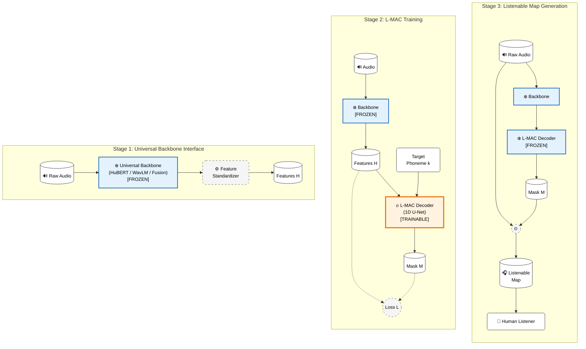

# 🏗️ L-MAC Architecture Diagram

Questo diagramma illustra l'architettura L-MAC (Listenable Maps for Audio Classifiers) seguendo il concetto di "Progressive Multi-Stage Pipeline", simile alla Figura 4 di VideoChat2.

## 📊 Progressive Stages

### 🗝️ Legenda

- **❄️ Blue Box (Frozen)**: Componenti pre-addestrati i cui pesi non cambiano (Backbone, e Decoder in fase di inferenza). Garantisce che L-MAC sia "plug-and-play".
- **🔥 Orange Box (Trainable)**: L'unico componente che apprende durante la Stage 2 (il Decoder 1D U-Net).
- **Cerchi/Ovali**: Dati in input/output (Audio, Feature, Maschere).
- **Tratteggiato**: Operazioni non parametriche (Loss, Standardizzazione, Moltiplicazione).

---

## 📖 Dettaglio degli Stadi (Progressive Pipeline)

L'architettura L-MAC è progettata per essere **modulare e plug-and-play**. Al contrario delle tecniche di interpretabilità classiche (come Grad-CAM o IG) che dipendono dai gradienti del backbone, L-MAC addestra un decoder separato.

### 🔵 Stage 1: Universal Backbone Interface (Interfaccia Universale)
In questa fase, l'obiettivo è astrarre il modello audio sottostante.
- **Universal Backbone [Frozen]**: Il sistema accetta qualsiasi modello pre-addestrato (HuBERT, WavLM, o loro Fusioni). Questo componente rimane **congelato** (i pesi non vengono aggiornati), preservando le conoscenze fonetiche originali.
- **Feature Standardizer**: Poiché modelli diversi hanno output dimensionali diversi (es. 768D per Base, 1024D per Large), questo blocco standardizza le feature $H$ prima che entrino nel decoder, garantendo compatibilità universale.
- **Risultato**: Una rappresentazione latente $H$ che incapsula la semantica audio, pronta per essere interpretata.

### 🟠 Stage 2: L-MAC Training (Addestramento Decoder)
Questa è l'unica fase che richiede training.
- **L-MAC Decoder (1D U-Net) [Trainable]**: Un piccolo decoder convoluzionale (ispirato a U-Net) prende in input le feature $H$ e il **Target Phoneme $k$** (il fonema che vogliamo spiegare).
- **Mask Generation**: Il decoder produce una maschera temporale $M \in [0, 1]^T$ che indica *dove* si trova il fonema target nell'audio.
- **Loss Function**: Il training è guidato da una loss composita che premia:
    1.  **Fedeltà**: L'audio mascherato deve mantenere la predizione originale del fonema $k$.
    2.  **Sparsità**: La maschera deve essere il più selettiva possibile (rimuovere tutto ciò che non serve).

### 🟢 Stage 3: Listenable Map Generation (Inferenza)
Una volta addestrato, il sistema genera spiegazioni udibili in tempo reale.
- **Inference**: Dato un nuovo audio, il backbone estrae le feature e il decoder genera la maschera $M$.
- **Element-wise Product ($\odot$)**: La maschera viene applicata direttamente alla forma d'onda originale (raw audio).
    $$ \text{Listenable Map} = \text{Audio} \odot M $$
- **Human/ASR Check**: Il risultato è un file audio riproducibile ("Listenable Map").
    - Se ascoltando la map si sente chiaramente il fonema target, la spiegazione è corretta.
    - Questo output è verificabile sia da umani che da sistemi ASR automatici.

---

## ✨ Vantaggi dell'Architettura
1.  **Backbone-Agnostic**: Funziona su qualsiasi modello senza ri-addestrarlo.
2.  **Lightweight**: Il decoder ha pochi parametri rispetto al backbone (training veloce).
3.  **Udibilità**: L'output non è una heatmap astratta, ma un suono ascoltabile.
