# 🏗️ L-MAC Architecture Diagram

Questo diagramma illustra l'architettura L-MAC (Listenable Maps for Audio Classifiers) seguendo il concetto di "Progressive Multi-Stage Pipeline", simile alla Figura 4 di VideoChat2.

## 📊 Progressive Stages

```mermaid
flowchart LR
    %% --- GLOBAL STYLES ---
    %% Increased font size and enforced high-contrast text colors
    classDef default font-family:sans-serif,font-size:14px;
    
    classDef frozen fill:#E3F2FD,stroke:#1565C0,stroke-width:2px,color:#000000;
    classDef trainable fill:#FFF3E0,stroke:#EF6C00,stroke-width:3px,color:#000000;
    classDef data fill:#FFFFFF,stroke:#333333,stroke-width:1px,rx:5,ry:5,color:#000000;
    classDef operation fill:#F5F5F5,stroke:#616161,stroke-width:1px,stroke-dasharray: 5 5,rx:10,ry:10,color:#000000;
    classDef title fill:none,stroke:none,color:#B71C1C,font-size:18px,font-weight:bold;
    classDef spacer fill:none,stroke:none,color:#000000,width:0px,height:0px;

    %% ==========================================
    %% STAGE 1: UNIVERSAL INTERFACE
    %% ==========================================
    subgraph S1 ["Stage 1: Universal Backbone Interface"]
        direction LR
        
        %% Nodes
        Audio1[("🔊 Raw Audio")]:::data
        Backbone1["❄️ Universal Backbone<br/>(HuBERT / WavLM / Fusion)<br/>[FROZEN]"]:::frozen
        Standardizer1["⚙️ Feature<br/>Standardizer"]:::operation
        Feat1[("Features H")]:::data
        
        %% Connections
        Audio1 --> Backbone1
        Backbone1 --> Standardizer1
        Standardizer1 --> Feat1
    end

    %% ==========================================
    %% STAGE 2: L-MAC TRAINING
    %% ==========================================
    subgraph S2 ["Stage 2: L-MAC Training"]
        direction TB
        
        %% Spacer to separate title from nodes
        SpacerS2[ ]:::spacer
        
        %% Top Row Nodes
        Audio2[("🔊 Audio")]:::data
        Backbone2["❄️ Backbone<br/>[FROZEN]"]:::frozen
        Feat2[("Features H")]:::data
        
        %% Training Core
        TargetPh["Target<br/>Phoneme k"]:::data
        LMAC2["🔥 L-MAC Decoder<br/>(1D U-Net)<br/>[TRAINABLE]"]:::trainable
        Mask2[("Mask M")]:::data
        
        %% Loss
        LossOp(("Loss L")):::operation
        
        %% Connections
        SpacerS2 ~~~ Audio2
        Audio2 --> Backbone2
        Backbone2 --> Feat2
        Feat2 --> LMAC2
        TargetPh --> LMAC2
        LMAC2 --> Mask2
        
        %% Loss Connections
        Mask2 -.-> LossOp
        Feat2 -.-> LossOp
    end

    %% ==========================================
    %% STAGE 3: INFERENCE & EXPLANATION
    %% ==========================================
    subgraph S3 ["Stage 3: Listenable Map Generation"]
        direction TB
        
        %% Spacer to separate title from nodes to fix overlap
        SpacerS3[ ]:::spacer
        
        %% Input
        Audio3[("🔊 Raw Audio")]:::data
        
        %% Path 1: Mask Gen
        Backbone3["❄️ Backbone"]:::frozen
        LMAC3["❄️ L-MAC Decoder<br/>[FROZEN]"]:::frozen
        Mask3[("Mask M")]:::data
        
        %% Path 2: Application
        DotProd(("⊙")):::operation
        ListenableMap[("🎧 Listenable<br/>Map")]:::data
        Human["👤 Human Listener<br/>/ ASR Check"]:::data
        
        %% Connections
        SpacerS3 ~~~ Audio3
        Audio3 --> Backbone3
        Backbone3 --> LMAC3 --> Mask3
        
        Audio3 --> DotProd
        Mask3 --> DotProd
        DotProd --> ListenableMap
        ListenableMap --> Human
    end
    
    %% Link the subgraphs logically (invisible links for layout)
    S1 ~~~ S2 ~~~ S3
```

### 🗝️ Legenda

- **❄️ Blue Box (Frozen)**: Componenti pre-addestrati i cui pesi non cambiano (Backbone, e Decoder in fase di inferenza). Garantisce che L-MAC sia "plug-and-play".
- **🔥 Orange Box (Trainable)**: L'unico componente che apprende durante la Stage 2 (il Decoder 1D U-Net).
- **Cerchi/Ovali**: Dati in input/output (Audio, Feature, Maschere).
- **Tratteggiato**: Operazioni non parametriche (Loss, Standardizzazione, Moltiplicazione).
